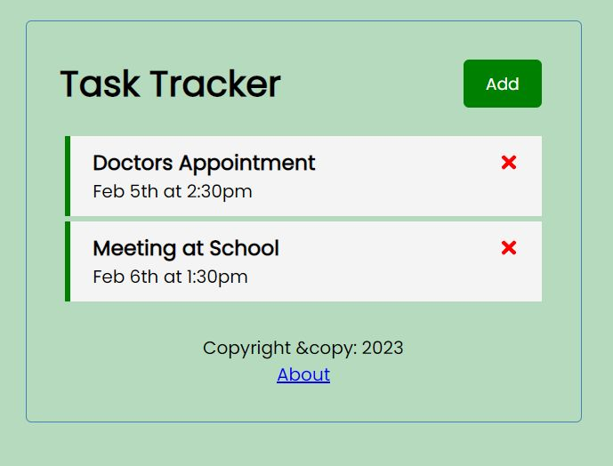
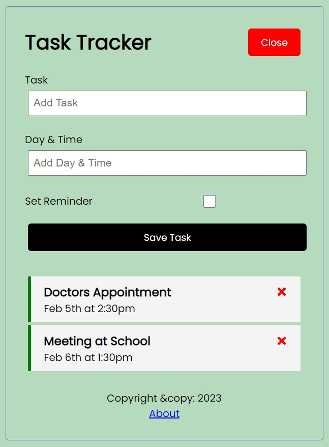
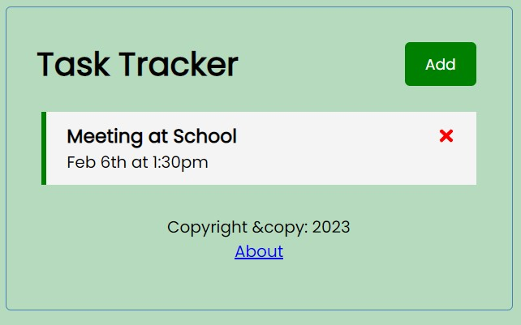
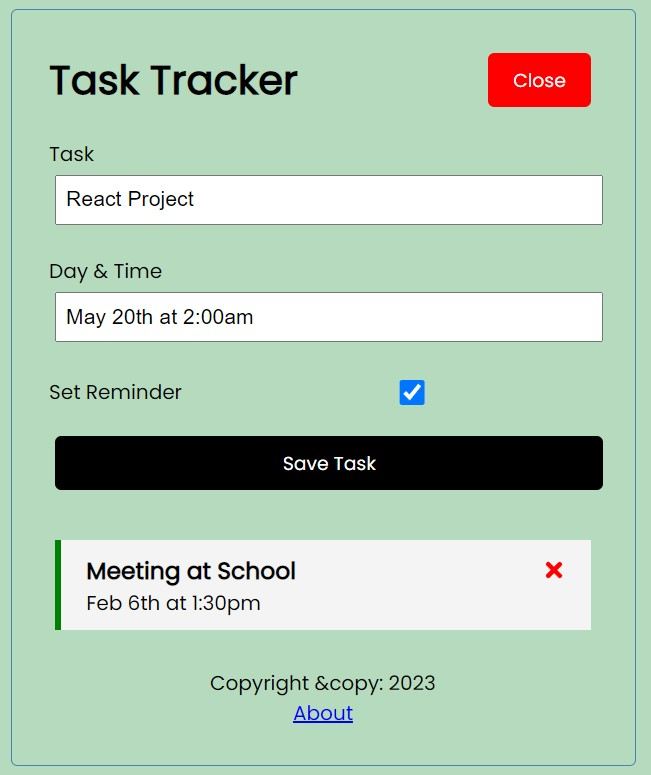
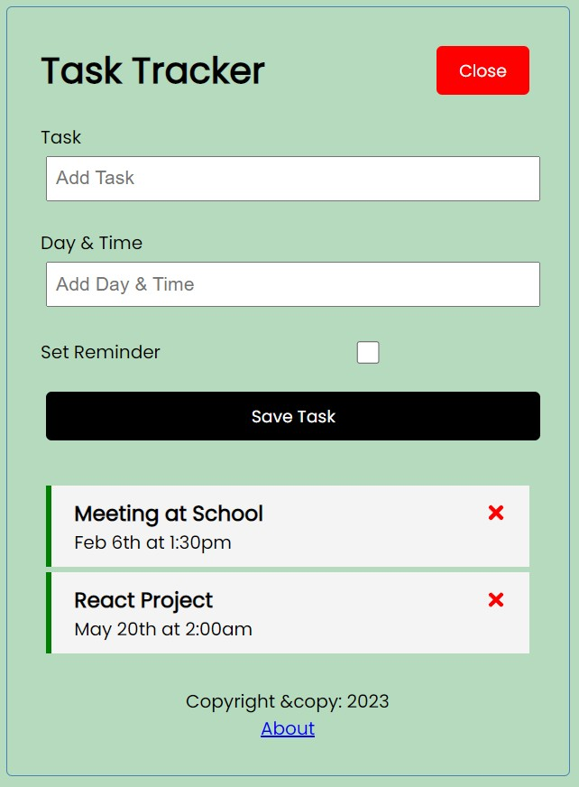
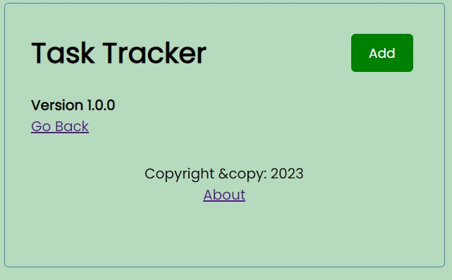

<h1>REACT-JS TASK TRACKER APP</h1>

| Version 1     | Snapshots       | |
| -------------- | -------------- |-------------- |
|  |  |  | 
|  |  |  |

 
 
 
In this React project I was able to build a task tracker app. I learned about components, props, state, hooks, working with API using JSON-server as a basic backend and so much more.
